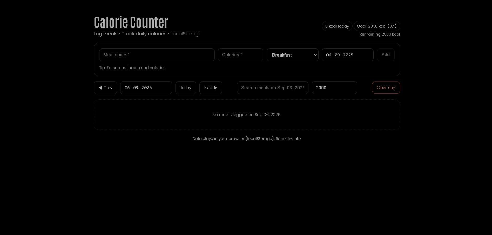

# Calorie Counter (React + styled-components)



**Live Demo:** https://a2rp.github.io/calorie-counter/

A clean, frontend-only Calorie Counter built with **React + styled-components**. Log meals, track daily calories vs goal, search, edit, and clear a day. Transparent UI that blends with a black/dark theme.

## Features

-   Add meals with **name, calories, type (Breakfast/Lunch/Dinner/Snack/Other), date**
-   **Daily total vs Goal** with % and remaining/over hint
-   **Date controls**: Prev / Today / Next
-   **Grouped by meal type**, quick search on the selected day
-   Edit & delete meals, **Clear Day** (with confirm)
-   **LocalStorage** persistence
-   **Custom confirm modal** (no portals)
-   Dark/black theme friendly (no background overrides)

## Local Install

```bash
# 1) Clone the repo
git clone https://github.com/a2rp/calorie-counter.git
cd calorie-counter

# 2) Install dependencies
npm i

# 3) Run dev server
npm run dev
```
