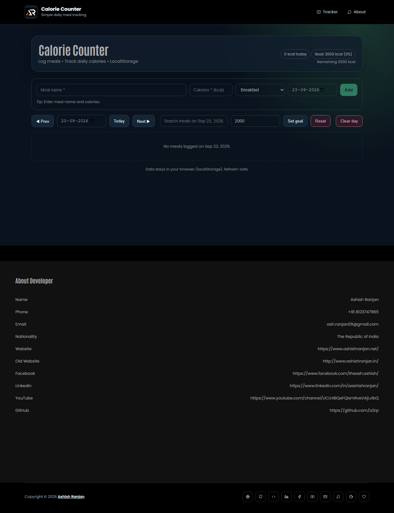

# Calorie Counter



A focused frontend calorie tracker for logging meals, comparing daily intake with a goal, and keeping data in the browser.

## Features

- Add, edit, search, group, and remove meals
- Track daily calories against a configurable goal
- Move between dates and clear a day with confirmation
- Persist meal data with localStorage
- Responsive layout with keyboard-friendly controls

## Tech stack

React, Vite, styled-components, react-icons, and localStorage.

## Run locally

```bash
npm install
npm run dev
```

## Deployment

```bash
npm run build
npm run deploy
```

Live app: [Calorie Counter](https://a2rp.github.io/calorie-counter/)

## Links

- Portfolio: [https://www.ashishranjan.net/](https://www.ashishranjan.net/)
- GitHub: [https://github.com/a2rp](https://github.com/a2rp)
- CodePen: [https://codepen.io/ash1198](https://codepen.io/ash1198)
- LinkedIn: [https://www.linkedin.com/in/aashishranjan](https://www.linkedin.com/in/aashishranjan)
- Facebook: [https://www.facebook.com/theash.ashish/](https://www.facebook.com/theash.ashish/)
- YouTube: [https://www.youtube.com/@ashishranjan-ashz?sub_confirmation=1](https://www.youtube.com/@ashishranjan-ashz?sub_confirmation=1)
- Email: [ash.ranjan09@gmail.com](mailto:ash.ranjan09@gmail.com)

## Support

- Support: [https://a2rp-donation-page.netlify.app/](https://a2rp-donation-page.netlify.app/)
- Buy Me a Coffee: [https://buymeacoffee.com/a2rp](https://buymeacoffee.com/a2rp)
- Patreon: [https://www.patreon.com/a2rp](https://www.patreon.com/a2rp)
